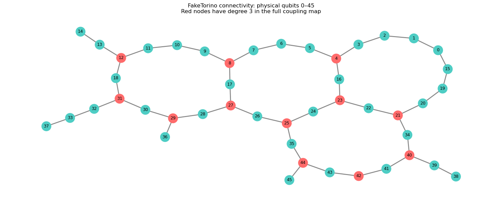
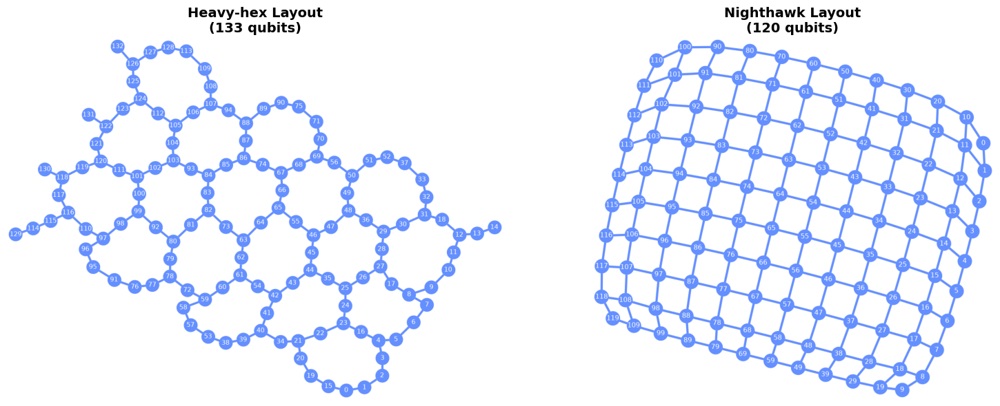
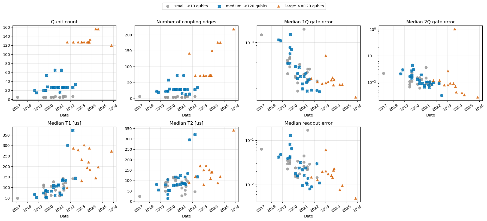

# QGSS 2026 Lab

A structured collection of notebooks, solutions, reusable Python utilities, and tests developed for the **Qiskit Global Summer School 2026**.

This repository contains the original laboratory notebooks, solutions, and a reusable Python package for quantum circuits, IBM Quantum hardware, noise modelling, execution, analysis, visualization, and error mitigation.

## Hardware Connectivity and Backend Analysis

### FakeTorino connectivity

The following graph shows the connectivity of physical qubits 0–45 on the
FakeTorino backend. Red nodes identify qubits with degree three in the full
coupling map.

<p align="center">
  
</p>

### Heavy-hex and Nighthawk layouts

The figure below compares the 133-qubit heavy-hex topology with the
120-qubit Nighthawk topology. The heavy-hex architecture has sparse,
branching connectivity, while the Nighthawk layout provides a denser
two-dimensional connectivity structure.

<p align="center">
  
</p>

### IBM Quantum hardware trends

The plots summarize the evolution of selected backend characteristics,
including:

- Number of qubits
- Number of coupling edges
- Median single-qubit gate error
- Median two-qubit gate error
- Median T1 coherence time
- Median T2 coherence time
- Median readout error

Backends are grouped into small, medium, and large systems according to
their number of qubits.

<p align="center">
  
</p>


## Repository Structure

```text
QGSS2026Lab/
├── notebooks/
│   ├── QGSS2026_Lab0.ipynb
│   ├── QGSS2026_Lab1.ipynb
│   ├── QGSS2026_Lab2.ipynb
│   ├── QGSS2026_Lab3.ipynb
│   ├── QGSS2026_Lab4a.ipynb
│   ├── QGSS2026_Lab4b.ipynb
│   └── QGSS2026_Lab4c.ipynb
│
├── solutions/
│   ├── QGSS2026_Lab1.ipynb
│   ├── QGSS2026_Lab2.ipynb
│   ├── QGSS2026_Lab3.ipynb
│   ├── QGSS2026_Lab4a.ipynb
│   ├── QGSS2026_Lab4b.ipynb
│   └── QGSS2026_Lab4c.ipynb
│
├── src/
│   └── qgss2026/
│       ├── __init__.py
│       ├── analysis.py
│       ├── circuits.py
│       ├── execution.py
│       ├── hardware.py
│       ├── mitigation.py
│       ├── noise.py
│       ├── operators.py
│       └── plotting.py
│
├── .gitignore
├── CHANGELOG.md
├── LICENSE
├── README.md
└── pyproject.toml
```

## Author

**Abiy Zelalem**

GitHub: [@Abiyzelalem27](https://github.com/Abiyzelalem27)

## Acknowledgements

This repository was created for educational and research purposes while working through the Qiskit Global Summer School 2026 laboratory materials.
